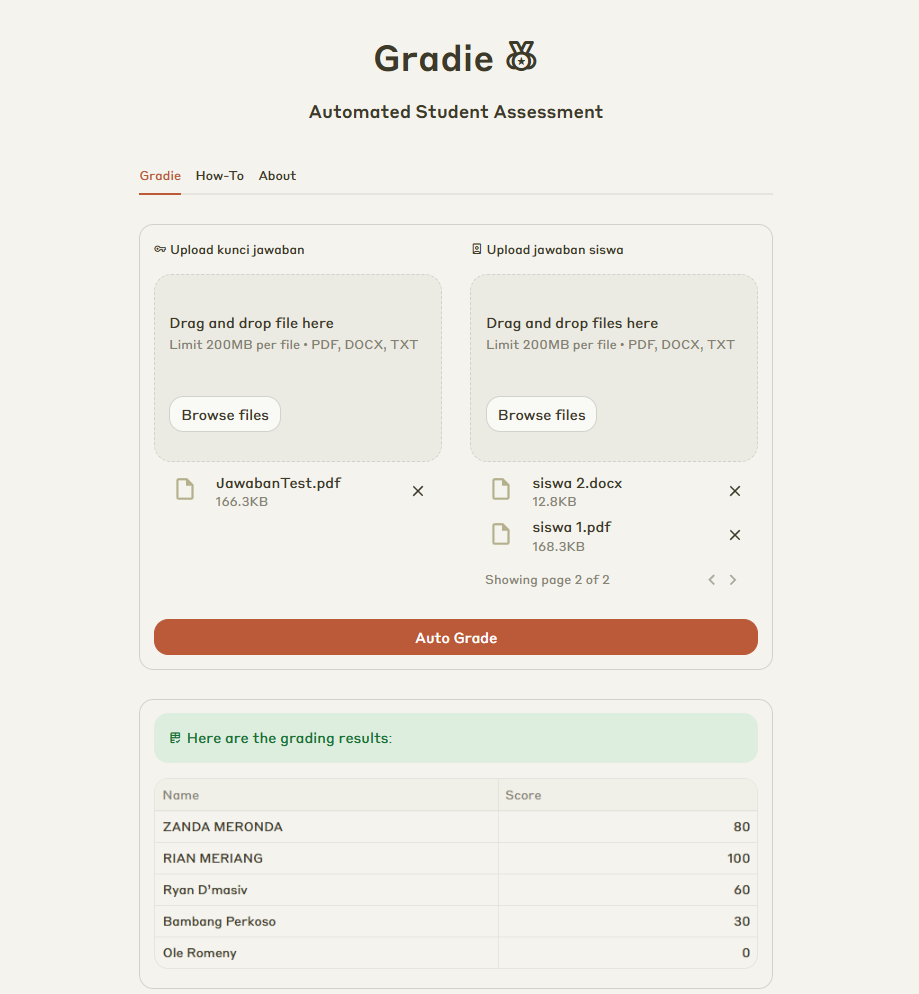

# Gradie 📘

Gradie adalah aplikasi koreksi otomatis berbasis AI yang dirancang untuk memudahkan guru menilai jawaban siswa. Cukup upload file kunci jawaban dan beberapa file jawaban siswa, lalu klik **Auto Grade** untuk langsung melihat tabel hasil penilaian. Gradie dibangun menggunakan model Llama 3.3 dan dijalankan melalui Groq untuk performa tinggi, dengan UI berbasis Streamlit.

## 🔍 Fitur

- Koreksi otomatis berdasarkan kunci jawaban
- Upload banyak file sekaligus
- Tampilkan hasil penilaian dalam bentuk tabel
- Antarmuka sederhana dan interaktif via Streamlit

## 🧠 Teknologi yang Digunakan

- [Llama 3.3](https://www.llama.com/docs/model-cards-and-prompt-formats/llama3_3/)
- [Groq](https://groq.com/) (LLM accelerator)
- Streamlit (UI)

## 🚀 Coba Aplikasi

> **Note:** Karena aplikasi dihosting menggunakan Streamlit Community Cloud (free tier), aplikasi bisa dalam kondisi sleep. Jika muncul tombol “Yes, get this app back up!”, klik tombol tersebut untuk membangunkan aplikasi.

🌐 [Link Demo Aplikasi](https://gradie.streamlit.app/)
